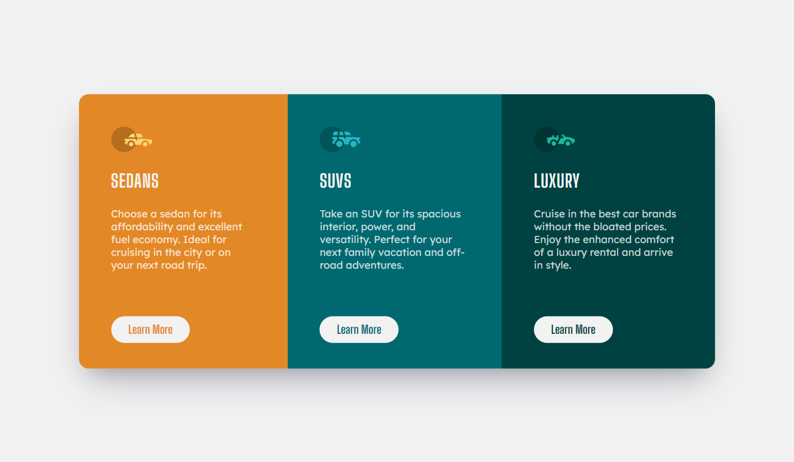

# Frontend Mentor - 3-column preview card component solution

This is a solution to the [3-column preview card component challenge on Frontend Mentor](https://www.frontendmentor.io/challenges/3column-preview-card-component-pH92eAR2-). Frontend Mentor challenges help you improve your coding skills by building realistic projects. 

## Table of contents

- [Overview](#overview)
  - [The challenge](#the-challenge)
  - [Screenshot](#screenshot)
  - [Links](#links)
- [My process](#my-process)
  - [Built with](#built-with)
- [Author](#author)

## Overview

### The challenge

Users should be able to:

- View the optimal layout depending on their device's screen size
- See hover states for interactive elements
- See popups when button is clicked

### Screenshot

### Links

- Solution URL: [https://www.frontendmentor.io/solutions/3-column-preview-card-component-K9ApjKvKf]
- Live Site URL: [https://jiale456.github.io/3-column-preview-card-component/#]

## My process

### Built with

- HTML5
- CSS3
- SCSS preprocessor
- JavaScript
- Mobile-first workflow
- RWD Concept

## Author

- GitHub - [jialeee17](https://github.com/jiale456)
- Frontend Mentor - [jialeee17](https://www.frontendmentor.io/profile/jiale456)

